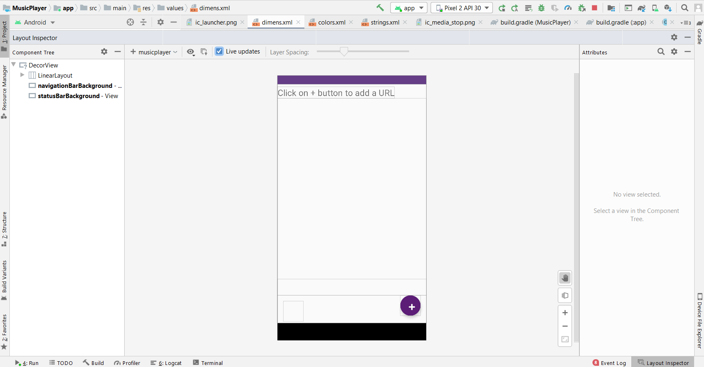

# Music Player App - Milestone Evaluation
This document provides an overview of the music player application created for this milestone evaluation.

## Project Overview

This music player app allows users to search for and play songs from a web service. Users can enter a song URL in the designated field, and the application will initiate playback using a background service. The application provides functionalities to start and stop song playback.

## Features

Search for songs via URL input
Play songs using a background service
Start/Stop playback control

## Layout

## URL
https://hipstrumentals.com/

## Functionalities

- Allows users to enter a URL for a song in a designated EditText field.
- Provides functionalities to play and stop the music using Floating Action Buttons (FABs).
- Implements animations for showing/hiding the URL input field and the "start/stop" FAB.
- Offers basic validation by checking if the entered URL is valid.
- Uses a background service (MusicService) to handle music playback.
- Defaults to a pre-defined song URL if the user doesn't provide any input.

## Software Components

- **Activity:** The primary component is the MusicActivity class which extends LifecycleLoggingActivity. This activity manages the UI, handles user interactions, and interacts with other components.
- **Floating Action Buttons (FABs):** Two FABs are used - one for adding/hiding the URL input field and another for controlling music playback (start/stop).
- **EditText:** An EditText field allows users to enter the desired song URL.
- **Service:** The MusicService runs in the background and is responsible for playing the song retrieved from the provided URL. This service likely interacts with the Android media framework for playback functionalities.
- **URL:** The application retrieves and plays music from user-provided URLs.
- **Animations**: The code utilizes predefined animations (fab_rotate_forward and fab_rotate_backward) to create visual effects when showing/hiding the URL input field and FAB.

## App Showcase

